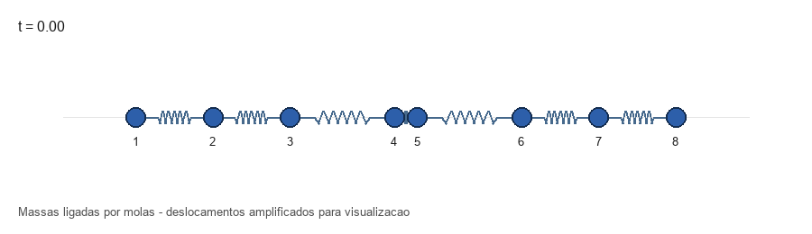
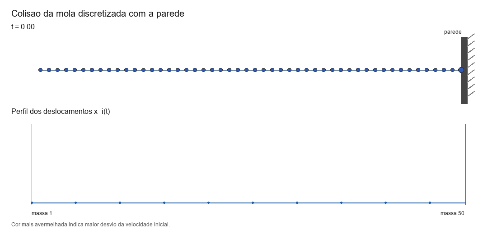
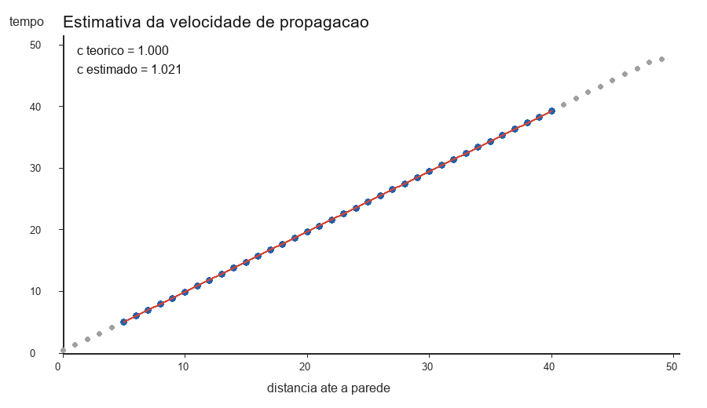

# Simulacao de uma mola macroscopica discretizada

Projeto computacional de MQA 2026-1 sobre uma cadeia unidimensional de massas e
molas. A ideia e modelar uma mola macroscopica como `N` massas identicas ligadas
por molas, estudar seus modos normais e usar esses modos para simular a evolucao
temporal do sistema.

O projeto foi dividido em seis partes:

1. Construcao da matriz elastica `A`.
2. Calculo de autovalores e autovetores.
3. Decomposicao das condicoes iniciais na base dos modos normais.
4. Evolucao temporal por modos normais.
5. Rotina numerica geral e animacao da cadeia massa-mola.
6. Simulacao da colisao da mola discretizada com uma parede.

## Ideia fisica

O vetor de deslocamentos das massas e

```text
x = [x_1, x_2, ..., x_N]^T.
```

A equacao de movimento pode ser escrita como

```text
m x'' = -k A x.
```

Aqui, `A` e a matriz elastica. Ela guarda quais massas estao conectadas por
molas. Para uma massa interna, a forca elastica tem a forma

```text
F_i = -k(2x_i - x_{i-1} - x_{i+1}).
```

Por isso, as linhas internas da matriz possuem o padrao

```text
... -1   2   -1 ...
```

Os autovetores de `A` sao os modos normais da cadeia. Cada autovalor `lambda_n`
determina uma frequencia natural:

```text
omega_n = sqrt((k/m) lambda_n).
```

Assim, qualquer movimento inicial pode ser decomposto como soma de modos normais,
e cada modo evolui como um oscilador harmonico simples.

## Estrutura dos arquivos

### Parte 1 - Matriz elastica

- `parte1_matriz_elastica.py`
- `parte1_resposta.md`

O arquivo `parte1_matriz_elastica.py` contem a funcao:

```python
matriz_elastica(N, k_fixos=None)
```

Ela constroi a matriz elastica `A` para uma cadeia aberta de `N` massas. O vetor
`k_fixos` representa as razoes `k_i/k` das molas extras que prendem massas a
pontos fixos.

### Parte 2 - Autovalores e autovetores

- `parte2_autovalores.py`
- `parte2_resposta.md`

O arquivo `parte2_autovalores.py` calcula os autovalores e autovetores
normalizados de `A` usando:

```python
np.linalg.eigh(A)
```

Essa funcao e adequada porque `A` e real e simetrica. Os resultados sao
ordenados por autovalor crescente.

### Parte 3 - Condicoes iniciais

- `parte3_condicoes_iniciais.py`
- `parte3_resposta.md`

Esta parte projeta os vetores iniciais `x0` e `v0` na base dos autovetores:

```python
coef_x0 = autovetores.T @ x0
coef_v0 = autovetores.T @ v0
```

Esses coeficientes dizem quanto de cada modo normal esta presente na condicao
inicial.

### Parte 4 - Evolucao temporal

- `parte4_evolucao_temporal.py`
- `parte4_resposta.md`

Esta parte calcula `x(t)` e `v(t)` a partir dos modos normais. A funcao principal
e:

```python
evoluir_temporalmente(A, x0, v0, tempos, k=1.0, m=1.0)
```

Ela retorna posicoes, velocidades, autovalores, frequencias, autovetores e
coeficientes das condicoes iniciais.

### Parte 5 - Rotinas numericas e animacao

- `parte5_rotinas_numericas.py`
- `parte5_resposta.md`
- `parte5_animacao.gif`
- `parte5_frame.png`

Esta parte cria uma rotina geral de simulacao:

```python
simular_sistema(N, A, x0, v0, k, m, t_inicial, t_final, num_tempos)
```

Tambem gera uma animacao da cadeia massa-mola usando `Pillow`.



### Parte 6 - Colisao com a parede

- `parte6_colisao_parede.py`
- `parte6_resposta.md`
- `parte6_colisao_parede.gif`
- `parte6_frame.png`
- `parte6_velocidade_sinal.png`

Nesta parte, a parede e modelada como uma mola extra ligada a ultima massa:

```text
A_colisao = A_livre + V
```

com

```text
V = (k_muro/k) e_N e_N^T.
```

Foram usados os parametros:

```text
N = 50
k = 1
m = 1
L = 1
v = 0.2
k_muro = 1
```

Resultados principais:

```text
tempo de descolamento = 101.91470
c teorico = 1.00000
c estimado = 1.02142
erro relativo = 2.14%
```



Grafico usado para estimar a velocidade do sinal:



